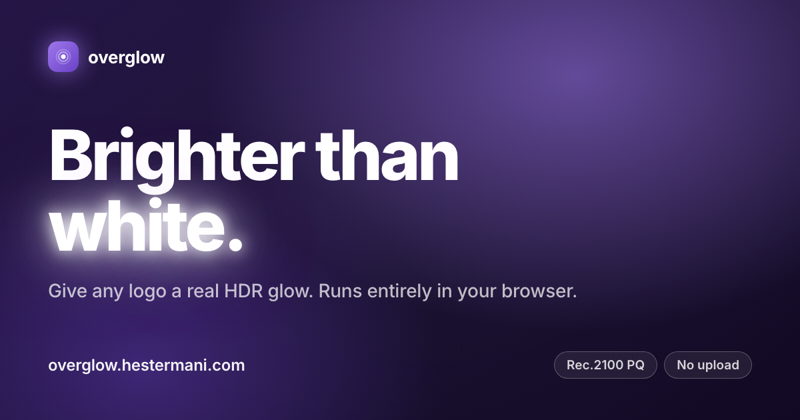

# overglow

**Give any logo a real HDR glow — in your browser.**

→ **[overglow.hestermani.com](https://overglow.hestermani.com)**



Most "glow" effects are a lie: they paint a soft halo around your logo and hope you
read it as light. Overglow does something different. It re-encodes your image as a
JPEG tagged with a **Rec.2100 PQ** HDR profile, so the white pixels are genuinely
instructed to display brighter than your screen's normal white.

On an HDR display, the whites don't look brighter. They *are* brighter.

Everything happens client-side. Nothing is uploaded, there's no account, and there's
no analytics.

---

## How it works

The interesting part is that HDR-in-a-JPEG is not a format — it's a color profile
and some careful math.

1. **Threshold.** Every pixel's `min(r,g,b)` is compared against a white threshold.
   Below it, the pixel is left alone; above it, it gets boosted. This is why
   "Highlights only" leaves a colored background untouched and lifts just the mark.
2. **Snap to white.** Near-white pixels (90–97%) are pulled to pure white *before*
   the boost. Without this, invisible JPEG noise in a white background amplifies
   into visible blotches at high nit values.
3. **Scale.** The boosted range is mapped from SDR reference white (203 nits) up to
   the chosen peak, expressed as a fraction of PQ's 10,000-nit ceiling.
4. **Primaries.** Linear values are converted from BT.709 to BT.2020 primaries.
5. **PQ encode.** Values go through the SMPTE ST 2084 transfer function. Because
   the PQ curve is brutally steep near black, this uses a 16,384-entry
   **sqrt-indexed lookup table** — the fine resolution lands where the curve needs
   it instead of being spread evenly.
6. **Dither.** 8 bits is not much to describe a 10,000-nit range, so the output is
   dithered. The live preview uses an 8×8 **Bayer** matrix (cheap, runs on every
   slider drag); the export uses **Floyd–Steinberg** error diffusion in PQ code
   space (slower, much cleaner gradients).
7. **Tag it.** A standard Rec.2100 PQ ICC profile is spliced into the JPEG as an
   `APP2` segment, chunked across multiple markers as the ICC spec requires,
   inserted after any existing `APP0`/`APP1`.

Without step 7 you get a dim, washed-out image. Without steps 1–6 the profile is a
lie and the result clips. You need both.

## Caveats

- **The glow only exists on HDR displays**, with low-power mode off. On SDR the page
  simulates it so you can still see what you're doing.
- **Screenshots kill it.** Most screenshot tools and re-saves strip the ICC profile.
  Share the file itself.
- **Flat graphics work best.** Logos, wordmarks, UI. Photographic gradients can band
  at 8-bit even with dithering.
- **Don't re-process an export.** Running an already-boosted file back through goes
  mushy.
- Some platforms re-encode uploads and strip the profile. Test before you rely on it.

## Running it locally

```bash
open index.html
```

That's the whole build step. `index.html` is fully self-contained — the ICC profile
is embedded as base64, the favicon is an inline SVG data URI, and the only network
request is a Google Fonts stylesheet. Save the one file and it works offline.

## Repo layout

```
index.html          the entire tool
og.png              social preview card
tools/og-card.html  source for og.png (rendered headless at 1200x630)
```

## Third-party code

The JPEG encoder is [jpeg-js](https://github.com/jpeg-js/jpeg-js) (MIT), itself
derived from Adobe-copyrighted code (BSD 3-Clause) ported by Andreas Ritter. Full
notices are retained inline. The ICC profile is a standard Rec.2100 PQ profile
generated via CoreGraphics.

## License

MIT — see [LICENSE](LICENSE).
