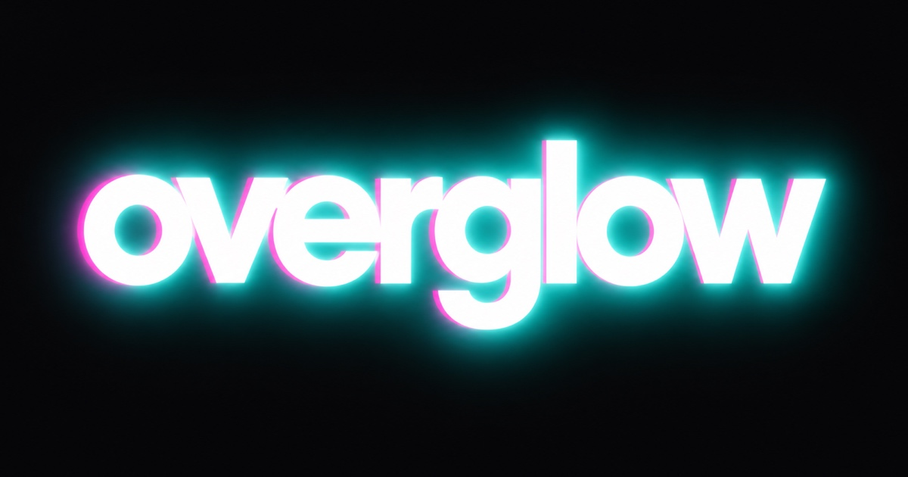

# overglow

**Give any logo a real HDR glow.**

→ **[overglow.hestermani.com](https://overglow.hestermani.com)**



---

## Run or deploy it with an AI agent

One copyable block covering local run, Cloudflare Pages deploy, and the four
failure modes that are not in Cloudflare's documentation.

<details>
<summary><b>Show the setup block</b> &nbsp;—&nbsp; then use GitHub's copy button in its top-right corner</summary>

Paste the block below into Claude Code, Codex, or any agent with shell access.
It covers running locally and deploying, including the failure modes that cost
real time the first time around.

```text
Set up "overglow", a single-page client-side tool that re-encodes an image as a
JPEG carrying a Rec.2100 PQ HDR profile so its whites render brighter than the
display's SDR white.

Repo: https://github.com/billums123/overglow

RUN LOCALLY - there is no build step.
    git clone https://github.com/billums123/overglow
    cd overglow
    open index.html          # macOS;  use xdg-open on Linux

index.html is fully self-contained: the ICC profile is embedded as base64 and
the favicon is an inline SVG data URI. The only network request is a Google
Fonts stylesheet. The event counter disables itself on file:// URLs.

DEPLOY TO CLOUDFLARE PAGES
Prereqs: a Cloudflare account, plus bun or node.

1. Authenticate with the minimum useful scopes:
     bunx wrangler login --scopes account:read user:read pages:write zone:read ssl_certs:write

2. Create the project. Pass --force the FIRST time and never again:
     bunx wrangler pages project create overglow --production-branch=main --force
   Without --force, wrangler delegates to the newer Workers-backed path, calls
   /accounts/<id>/workers/services/overglow and dies with
   "Authentication error [code: 10000]" unless the token also carries
   workers:write. --force targets the classic Pages API instead.

3. Deploy. dist/ is the deploy root and contains only index.html, og.png and
   _headers. Pages Functions are picked up from functions/ automatically.
     cp index.html og.png _headers dist/
     bunx wrangler pages deploy dist --project-name=overglow

OPTIONAL - the anonymous event counter
functions/api/count.js increments integers in a KV namespace bound as COUNTERS.
functions/api/stats.js reads them back at /api/stats. With no binding the
counter no-ops silently and the site still works.

     bunx wrangler kv namespace create overglow_counters

If that also returns "Authentication error [code: 10000]", it is the same
delegation problem and this subcommand has no --force. Create it over the REST
API instead, then put the returned id into wrangler.jsonc under kv_namespaces
and redeploy:

     curl -X POST "https://api.cloudflare.com/client/v4/accounts/<ACCOUNT_ID>/storage/kv/namespaces" \
       -H "Authorization: Bearer <TOKEN>" \
       -H "Content-Type: application/json" \
       -d '{"title":"overglow_counters"}'

OPTIONAL - a custom domain
Attach it by POSTing {"name":"<subdomain>"} to
/accounts/<ACCOUNT_ID>/pages/projects/overglow/domains

That does NOT create the DNS record, even when the zone lives in the same
account - only the dashboard flow does. Add a proxied CNAME pointing
<subdomain> at overglow.pages.dev yourself. Note that wrangler's OAuth exposes
NO DNS scope at any level, so an agent cannot do this step; it needs the
dashboard or an API token with Zone:DNS:Edit. Then PATCH the same domains
endpoint to re-verify, and the status moves pending -> active within a minute.

VERIFY
     curl -s -o /dev/null -w "%{http_code}\n" https://overglow.pages.dev/
     curl -s https://overglow.pages.dev/api/stats

Export a file from the running page and confirm the profile survived:
     sips -g profile out.jpg      # expect: Rec. ITU-R BT.2100 PQ
```

</details>

---


Most "glow" effects are a lie: they paint a soft halo around your logo and hope you
read it as light. Overglow does something different. It re-encodes your image as a
JPEG tagged with a **Rec.2100 PQ** HDR profile, so the white pixels are genuinely
instructed to display brighter than your screen's normal white.

On an HDR display, the whites don't look brighter. They *are* brighter.

Everything happens client-side: your image is never uploaded and there's no account.
Three anonymous integers are counted — see [What is counted](#what-is-counted).

---

## How it works

The interesting part is that HDR-in-a-JPEG is not a format — it's a color profile
and some careful math.

1. **Threshold.** Every pixel's `min(r,g,b)` is compared against a white threshold.
   Below it, the pixel is left alone; above it, it gets boosted. This is why
   "Highlights only" leaves a colored background untouched and lifts just the mark.
2. **Snap to white.** Near-white pixels (90–97%) are pulled to pure white *before*
   the boost. Without this, invisible JPEG noise in a white background amplifies
   into visible blotches at high nit values.
3. **Scale.** The boosted range is mapped from SDR reference white (203 nits) up to
   the chosen peak, expressed as a fraction of PQ's 10,000-nit ceiling.
4. **Primaries.** Linear values are converted from BT.709 to BT.2020 primaries.
5. **PQ encode.** Values go through the SMPTE ST 2084 transfer function. Because
   the PQ curve is brutally steep near black, this uses a 16,384-entry
   **sqrt-indexed lookup table** — the fine resolution lands where the curve needs
   it instead of being spread evenly.
6. **Dither.** 8 bits is not much to describe a 10,000-nit range, so the output is
   dithered. The live preview uses an 8×8 **Bayer** matrix (cheap, runs on every
   slider drag); the export uses **Floyd–Steinberg** error diffusion in PQ code
   space (slower, much cleaner gradients).
7. **Tag it.** A standard Rec.2100 PQ ICC profile is spliced into the JPEG as an
   `APP2` segment, chunked across multiple markers as the ICC spec requires,
   inserted after any existing `APP0`/`APP1`.

Without step 7 you get a dim, washed-out image. Without steps 1–6 the profile is a
lie and the result clips. You need both.

## Caveats

- **The glow only exists on HDR displays**, with low-power mode off. On SDR the page
  simulates it so you can still see what you're doing.
- **Screenshots kill it.** Most screenshot tools and re-saves strip the ICC profile.
  Share the file itself.
- **Flat graphics work best.** Logos, wordmarks, UI. Photographic gradients can band
  at 8-bit even with dithering.
- **Don't re-process an export.** Running an already-boosted file back through goes
  mushy.
- Some platforms re-encode uploads and strip the profile. Test before you rely on it.

## What is counted

Three numbers, and nothing else: how many images were opened, how many times the
demo was tried, and how many files were exported.

The entire request body is one word from an allowlist:

```json
{"event": "export"}
```

No IP address, user agent, cookie, referrer, session or identifier is stored, and
there is no per-event record — only integers that go up. **Your image is never
sent anywhere**; it is read, processed and written entirely in your browser, and
counting that an export happened does not involve the file itself.

Counts are public at [`/api/stats`](https://overglow.hestermani.com/api/stats).
They are approximate: increments are read-modify-write against Cloudflare KV, so
simultaneous events can overwrite one another. They are a gauge, not an audit
trail. Keys are sharded because KV allows one write per second per key.

The code is `functions/api/count.js` (write) and `functions/api/stats.js` (read) —
about 100 lines total, worth reading if you would rather verify than trust.

## Running it locally

```bash
open index.html
```

That's the whole build step. `index.html` is fully self-contained — the ICC profile
is embedded as base64, the favicon is an inline SVG data URI, and the only network
request is a Google Fonts stylesheet. Save the one file and it works offline.

## Repo layout

```
index.html             the entire tool
og.png                 social preview card
functions/api/count.js anonymous event counter (Cloudflare Pages Function)
functions/api/stats.js public aggregate counts
tools/og-card.html     source for og.png (rendered headless at 1200x630)
```

## Third-party code

The JPEG encoder is [jpeg-js](https://github.com/jpeg-js/jpeg-js) (MIT), itself
derived from Adobe-copyrighted code (BSD 3-Clause) ported by Andreas Ritter. Full
notices are retained inline. The ICC profile is a standard Rec.2100 PQ profile
generated via CoreGraphics.

## License

MIT — see [LICENSE](LICENSE).
